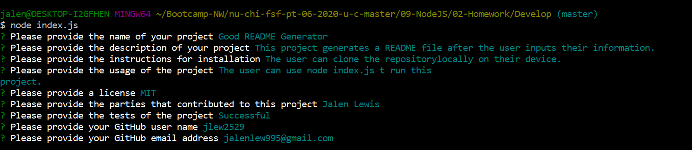

  # Good README Generator

  

  ## Description

  This project generates a README file after the user inputs their information.

  ## Table of Contents

  [Description](#Description)
  [Installation](#Installation)
  [Usage](#Usage)
  [License](#License)
  [Contributors](#Contributors)
  [Test](#Test)
  [Respository](#Repository)
  [Github Profile](#Github)
  
  ## Installation

  The usercan clone the repository locally on their device.

  ## Usage

  The user can use node index.js to run this project.

  ## Contributors

  Jalen Lewis

  ## Test 

  Successful

  ## Questions

  Contact Info:

  GitHub: [https://github.com/jlew2529](https://github.com/jlew2529)
  Email Address: [jalenlew1995@gmail.com](jalenlew1995@gmail.com)
